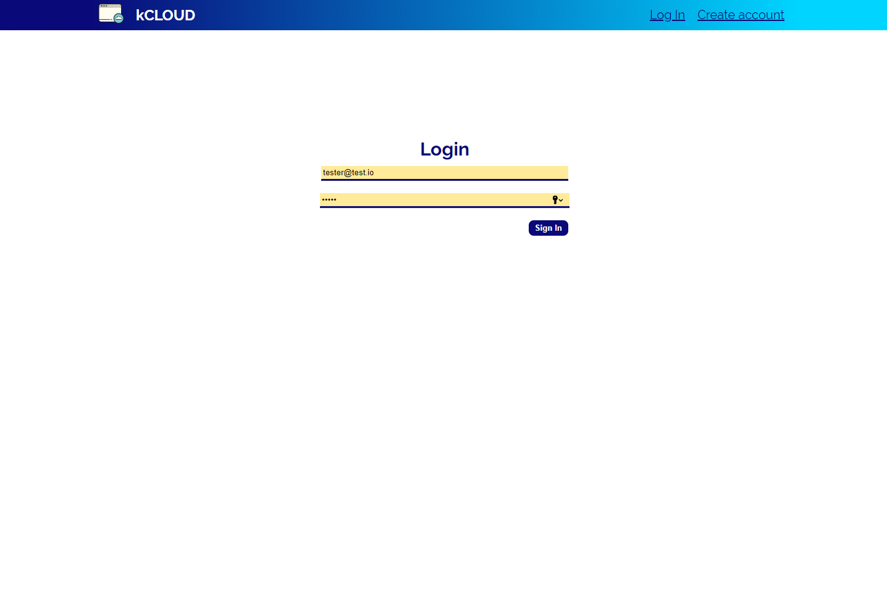
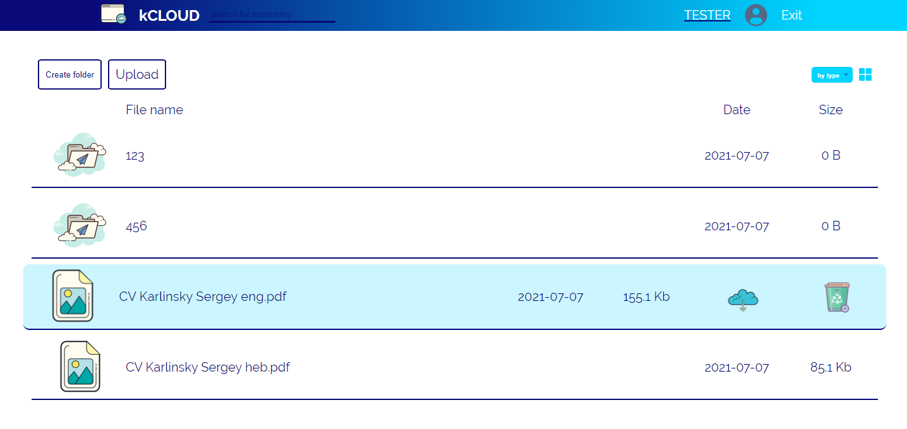
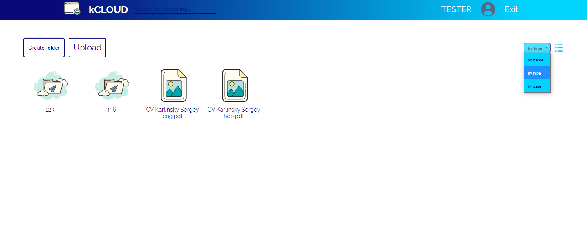
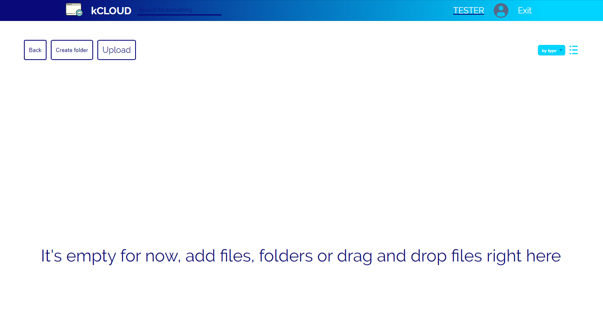
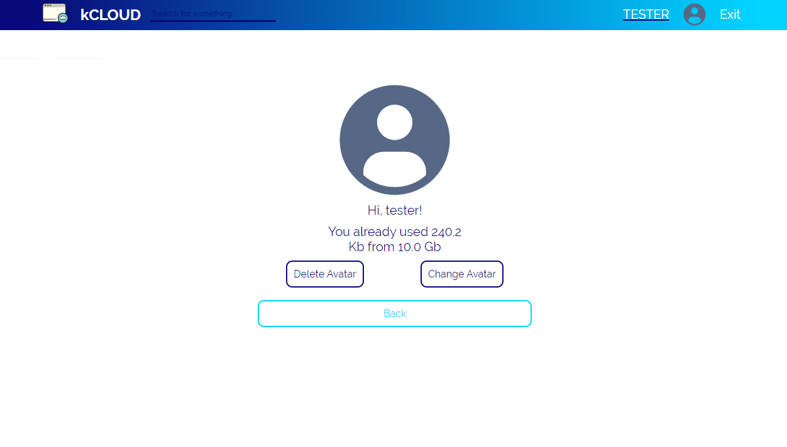

## **Frontend for @k-cloud service**

This is an example of cloud service with registration, storage files, folders and avatar editing<br />
Backend part. <br />

🕹 Demo is <a href="https://kcloud-react.herokuapp.com" target="_blank">**here**</a> (30-40 seconds for start on herokku)🕹 

Backend code is <a href="https://github.com/ieffai/k-cloud-back" target="_blank">**here**</a>.

### Local Deploy

Install all dependencies, in repo's root:

```
1. $ npm install
2. $ npm start

```

- **Used technologies**

  - React, redux, redux-thunk
  - axios, express
  - sass

## 

## 

## 

## 

## 

**For suggestions and errors:**
4923920@gmail.com
